# Projeto Blogs API

# Contexto
Esse projeto trata-se de uma API onde deverá ser possível fazer o cadastro e login de pessoas usuárias,
onde essas pessoas poderão fazer posts, modifica-los ou deleta-los. 

## Técnologias usadas

Back-end:
> Desenvolvido usando: NodeJS, ExpressJS, MySQL(sequelize), ES6, JWT, JEST(teste de integração), bcrypt.

## Instalando Dependências

Clone o repositório:

```git clone git@github.com:Arthur-Jr/blogs-api.git ```

Na raiz do projeto:
```bash
npm install
``` 
## Executando aplicação

É necessário renomeear o arquivo .env.dev para .env.


Ainda no arquivo .env é necessário colocar o usuário e a senha do mysql assim como a porta que aplicação ira rodar.

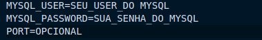

* É necessário que o MySQL esteja ativo.

  Para checar o status do MySQL:
    ```
    sudo systemctl status mysql
    ```
  Para iniciar o MySQL:
    ```
    sudo systemctl start mysql
    ```
 
* Iniciando a aplicação:
    ```
    npm start
    ```

## Executando Testes

É necessário mudar o valor da key NODE_ENV para "teste" no arquivo .env.

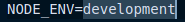 = 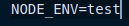

Tem que reiniciar o npm start após a mudança no ```NODE_ENV```.

* Para rodar todos os testes:
  
  Com o ``` npm start``` ativo.
  ```
    npm test
  ```
  
## End-Points

É necessário utilizar o [Insomnia](https://insomnia.rest/download) ou [Postman](https://www.postman.com/)
para fazer requisições de qualquer tipo diferente do GET.

 * O que é necessário para fazer requisições e sua respostas:

    * O end-point (POST /user)
    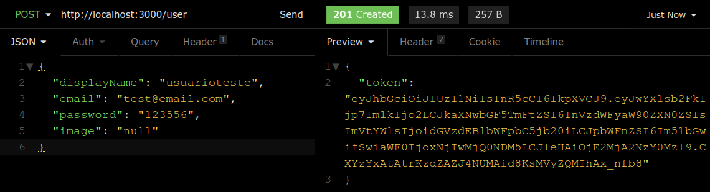
  
    * O end-point (POST /login)
    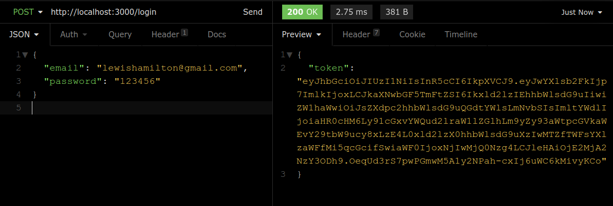
  
    * O end-point (GET /user)
    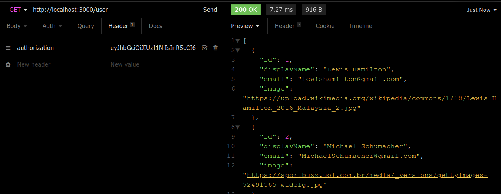
    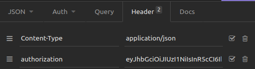

    * O end-point (GET /user/:id)
    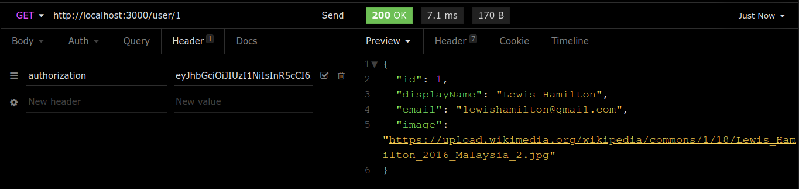
    

    * O end-point (POST /categories)
    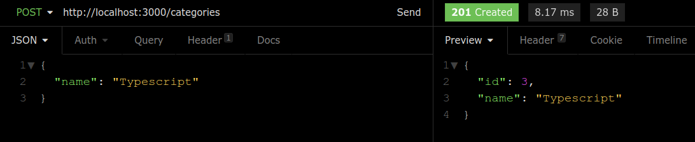
    
  
    * O end-point (GET /categories)
    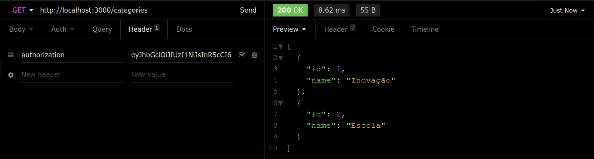
    

    * O end-point (POST /post)
    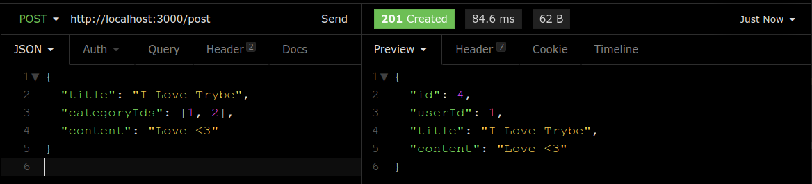
    
  
    * O end-point (GET /post)
    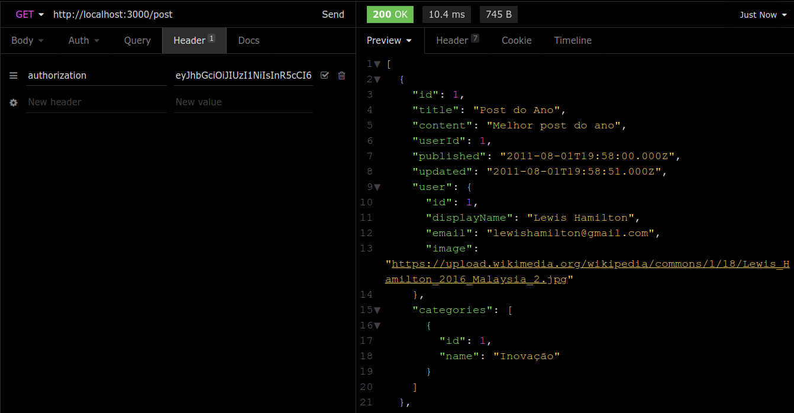
    
  
    * O end-point (GET /post/:id)
    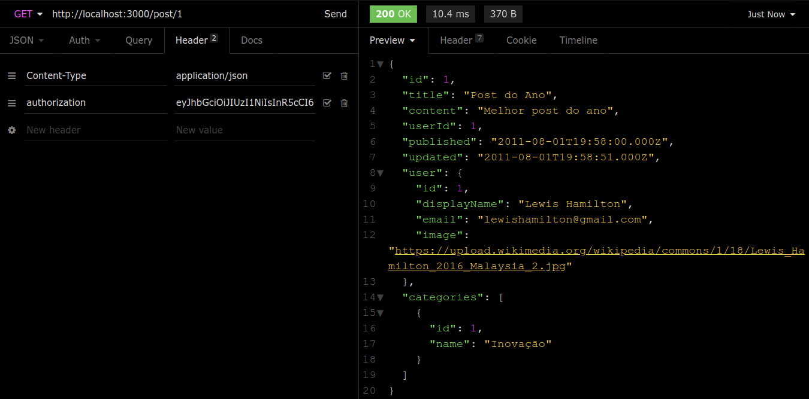
    
  
    * O end-point (PUT /post/:id)
    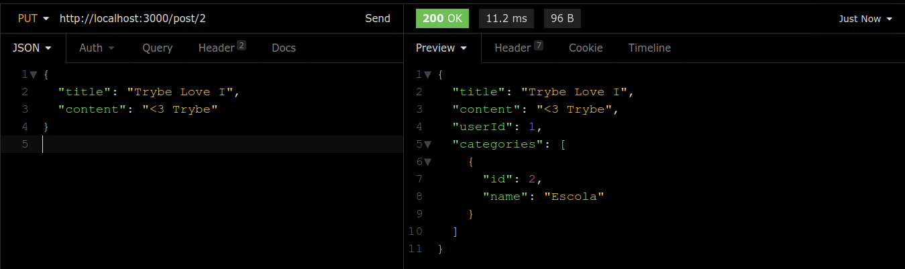
    
  
    * O end-point (DELETE post/:id)
    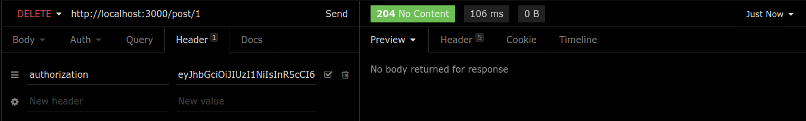
    
  
    * O end-point (DELETE /user/me)
    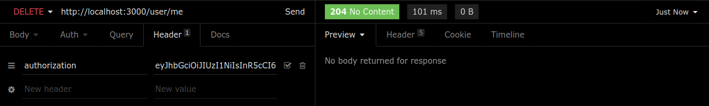
    
  
    * O end-point (GET /post/search?q='')
    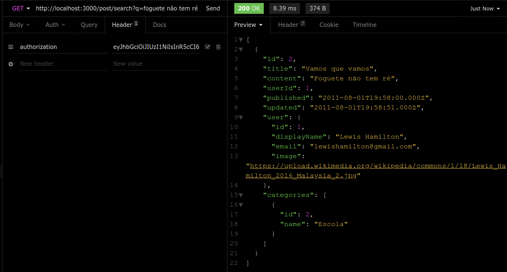
    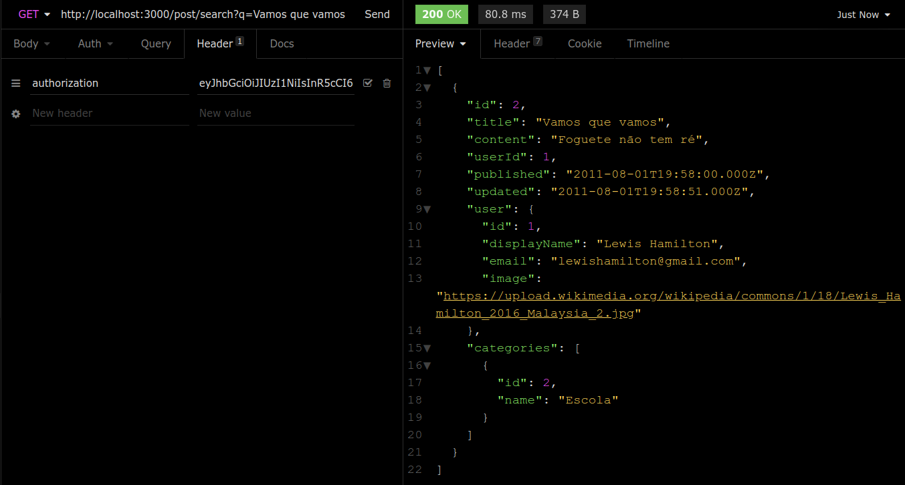
    
